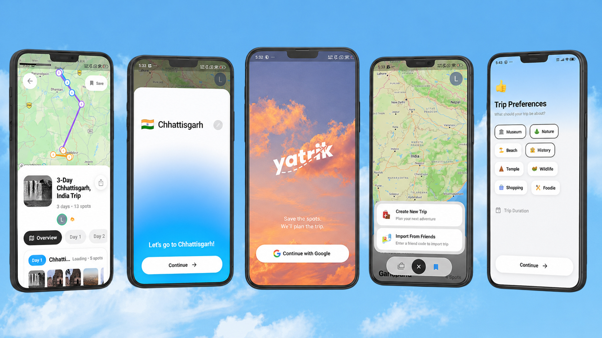

# 🌍 Yatrik

> An ML-powered travel planning app that recommends tourist destinations and creates personalized trip itineraries.
> 🔗 Backend: Deployed on Render
> ⚠️ Note: The backend may take a few seconds to respond on the first request because it is hosted on a free tier.

---

## 📖 Overview

**Yatrik** is a smart travel planner that helps users discover tourist places and generate day-wise trip itineraries based on their selected city, state, trip duration, and travel preferences.

The project includes a **Flutter mobile app frontend** and a **FastAPI machine learning backend**.  
The backend recommends tourist spots using a trained ML model and returns location data such as latitude and longitude for map-based visualization.

---
## 📱 App Preview

<p align="center">
  
</p>
## ✨ Features

### 📱 Flutter App

- Modern Flutter UI
- Firebase Google Sign-In authentication
- Travel preference selection
- Day-wise itinerary generation
- Share generated trip plan with others
- Mapbox map integration
- Tourist spot location support
- Smooth navigation and responsive design
- Connects with FastAPI backend

### 🧠 Backend API

- FastAPI-based backend
- Machine learning recommendation system
- Tourist spot filtering based on user preferences
- Generates personalized itinerary
- Returns latitude and longitude for map markers
- Uses tourist places dataset
- Deployed on Render

---
## 📦 Demo APK

Download and try the demo APK:

[Download Yatrik Demo APK](https://github.com/LeviLabs/Yatrik/releases/latest)

> Note: Internet connection is required.
> The backend is hosted on Render, so the first request may take some time.

---

## 🛠️ Tech Stack

### Frontend (`client/`)

| Category | Technology |
|---|---|
| Framework | Flutter |
| Language | Dart |
| Authentication | Firebase Auth |
| Maps | Mapbox |
| Environment | flutter_dotenv |
| Platform | Android / iOS |

### Backend (`server/`)

| Category | Technology |
|---|---|
| Runtime | Python |
| Framework | FastAPI |
| ML Library | Scikit-learn |
| Data Handling | Pandas |
| Model File | Pickle / Joblib |
| Dataset | CSV |
| Deployment | Render |

---

## 📁 Project Structure

```txt
Yatrik/
├── client/                   # Flutter frontend app
│   ├── android/
│   ├── ios/
│   ├── lib/
│   │   ├── screens/          # App screens
│   │   ├── services/         # API / Mapbox services
│   │   └── data/             # Local destination data
│   ├── assets/               # Images and app assets
│   ├── pubspec.yaml
│   └── README.md
│
└── server/                   # FastAPI backend
    ├── app.py                # Main FastAPI app
    ├── requirements.txt      # Python dependencies
    ├── chhattisgarh_tourist_places.csv
    └── rf_tourist_model.pkl  # Trained ML model

```

---

## 🚀 Getting Started

Follow these steps to clone and run the Flutter app locally.

### Prerequisites

Make sure you have installed:

- Flutter SDK
- Android Studio or VS Code
- Android Emulator or physical Android device
- Git

Check Flutter installation:

```bash
flutter doctor
```

### 1. Clone the Repository

```bash
git clone https://github.com/LeviLabs/Yatrik.git
cd Yatrik
```

### 2. Open Flutter App Folder

```bash
cd client
```

### 3. Install Flutter Dependencies

```bash
flutter pub get
```

### 4. Add Environment Variables

Create a `.env` file inside the `client/` folder:

```env
MAPBOX_ACCESS_TOKEN=your_mapbox_access_token_here
API_BASE_URL=https://your-render-backend-url.onrender.com
```

> Do not push the `.env` file to GitHub.

### 5. Run the Flutter App

```bash
flutter run
```

### 6. Build APK

To generate a release APK:

```bash
flutter build apk --release
```

APK output path:

```txt
client/build/app/outputs/flutter-apk/app-release.apk
```
## 🗂️ API Reference

| Method | Endpoint | Description |
|---|---|---|
| `GET` | `/` | Check backend status |
| `POST` | `/recommend` | Generate tourist spot recommendations and day-wise itinerary |

---

## 📥 Sample Request

```json
{
  "City": "Raipur",
  "State": "Chhattisgarh",
  "Days": 4,
  "Is_Museum": 1,
  "Is_Nature": 1,
  "Is_Beach": 0,
  "Is_History": 1,
  "Is_Temple": 0,
  "Is_Wildlife": 0,
  "Is_Shopping": 0,
  "Is_Foodie": 0
}
```

---

## 📤 Sample Response

```json
{
  "success": true,
  "mode": "city",
  "place": "Raipur",
  "days": 4,
  "spots_found": 20,
  "itinerary": [
    {
      "day": 1,
      "place_name": "Nandanvan Zoo Raipur",
      "city": "Raipur",
      "state": "Chhattisgarh",
      "lat": 21.21,
      "lng": 81.65,
      "ideal_hours": 3.0,
      "categories": ["Wildlife"]
    }
  ]
}
```
## 📜 Scripts

### Flutter App

```bash
flutter pub get       # Install Flutter dependencies
flutter run           # Run Flutter app
flutter build apk     # Build Android APK
```

### Backend

```bash
pip install -r requirements.txt                  # Install backend dependencies
uvicorn app:app --reload                         # Run backend locally
uvicorn app:app --host 0.0.0.0 --port $PORT      # Render start command
```

---

> Built for smart and personalized travel planning 🌍
